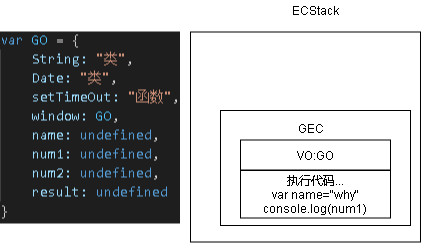

**案例代码**
```javascript
var name = "why"

console.log(num1)

var num1 = 20
var num2 = 30
var result = num1 + num2

console.log(result)
```
1. 编译器在解析代码的时候，JS引擎(ES3以前)会创建一个GO对象
pseudo code:
```javascript
var GO = {
    String: "类",
    Date: "类",
    setTimeOut: "函数",
    window: GO,
    name: undefined,
    num1: undefined,
    num2: undefined,
    result: undefined
}
```
2. 运行代码
   1. JS引擎（例如v8），会建一个执行上下文栈（execution context stack ECStack）
   2. 开始全局执行代码，创建全局执行上下文(global execution context GEC)，入栈ECStack
   3. GEC中有一个VO(variable object)指向GO
   4. 按顺序执行代码，还未赋值被访问的变量就是undefined

