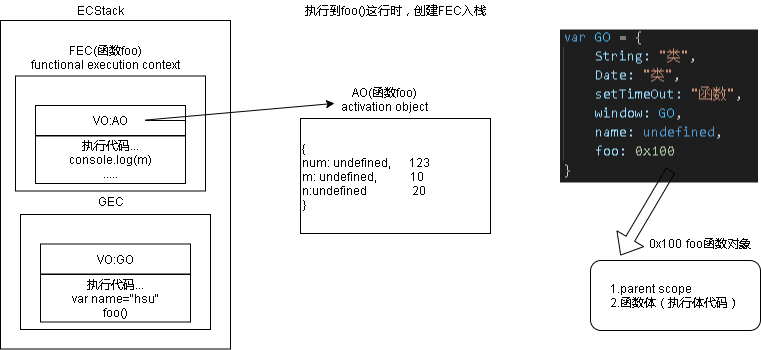

**案例代码**
```javascript
var name = "hsu"

foo(123)
function foo(num) {
  console.log(m)
  var m = 10
  var n = 20

  console.log(name)
}

console.log(aaaaaaa)
```

1. 编译器在解析代码的时候，JS引擎(ES3以前)会创建一个GO对象，解析到foo是一个函数，会申请内存空间创建foo函数对象,函数地址赋值给foo变量,函数对象内存空间包括parent scope和函数执行体代码
pseudo code:
```javascript
var GO = {
    String: "类",
    Date: "类",
    setTimeOut: "函数",
    window: GO,
    name: undefined,
    foo: 0x100
}
```
1. 运行代码（视频02/00:38:00)
   1. JS引擎（例如v8），会建一个执行上下文栈（execution context stack ECStack）
   2. 开始全局执行代码，创建全局执行上下文(global execution context GEC 全局代码需要被执行时才会创建)，入栈ECStack
   3. GEC中有一个VO(variable object)指向GO
   4. 执行到foo()这一句时调用函数foo，创建FEC函数调用执行上下文入栈，创建foo的AO对象，里边变量都为undefined，
   5. 执行foo里边代码，修改AO对象里面的值
   6. foo执行完后FEC出栈销毁，foo的AO销毁
